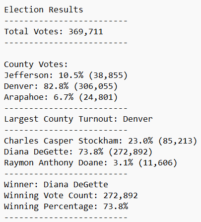

Overview of Election Audit

The purpose of this election audit was to collate the votes and turnout from each county and establish the winner of the election, with data points to back up the result. To do this we tabulated votes for each candidate, divided up by county, while calculating both the percentages of votes for each candidate as well as voter turnout by county, a data point that might be useful for further analysis later on.

Election-Audit Results

The election audit produced the following results

To summarize:

* There were 369,711 votes cast in the election
    * Jefferson County cast 38,855 votes for 10.5% of the overall vote
    * Denver county cast 306,055 votes for 82.8% of the overall vote
    * Arapahoe cast 24,801 votes for 6.7% of the overall vote
    * Denver county had the largest voter turnout by far
* The candidate vote counts are as follows
    * Charles Casper Stockham got 23% of the overall vote with 85,213 votes
    * Raymon Anthony Doane got 3.1% of the vote with 11,606 votes
    * Diana DeGette got 73.8% of the cote with 272,892 votes
    * The winner, by a landslide, was Diana DeGette

Election-Audit Summary

This script could be used for a wide array of election audits with minor edits to the code. For instance, on a national level election where there are more subsets to the data, you could add a loop that cycles through the states and then nested within that put the loop that cycles through the counties. That way you could see the data by state AND county, pulling more workable data to analyze for trends before the next election, and also dividing up the data into smaller subsets to make it easier to audit in case there are concerns of fraud.

Another way this script could be used in a more cohesive way is to add functionality to not just pull voter turnout by county, but pull how many votes each candidate got within that specific county. You could do this in numerous ways, with one such being an if else if statemount while votes are being tabulated by county in the for loop that saves that vote by candidate to a variable specific to each candidate, to be printed/saved at the end of the loop. This would show if certain counties skewed towards certain candidates, allowing research to be done regarding why and if the results raise any concern. 

These are the two most obvious examples, but there are a number of other ways this code could be more broadly applied with minor edits